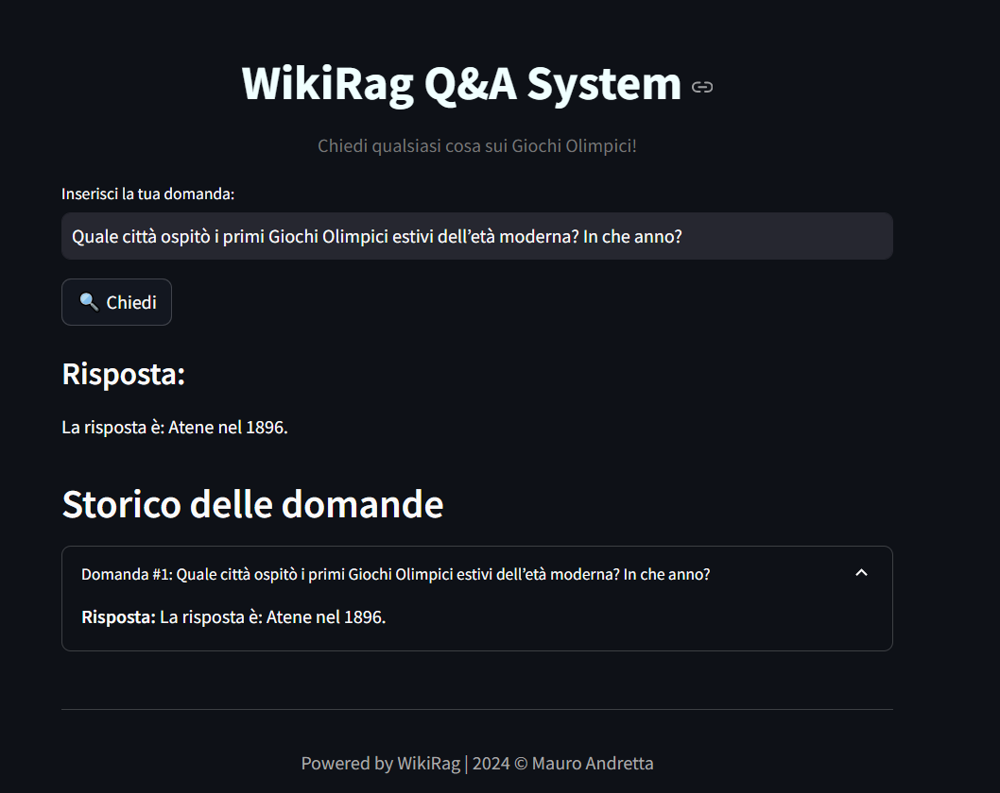

# WikiRag

## Table of Contents
- [Overview](#overview)
- [Code Directory](#code-directory)
- [WikiRag: Conversational RAG with Wikipedia Knowledge Base](#wikirag-conversational-rag-with-wikipedia-knowledge-base)
  - [How It Works](#how-it-works)
  - [Example Usage](#example-usage)
  - [Ask a Question](#ask-a-question)
  - [Evaluation of WikiRag](#evaluation-of-wikirag)
    - [Key Elements of Evaluation](#key-elements-of-evaluation)
    - [Focus of the Evaluation Notebook](#focus-of-the-evaluation-notebook)
    - [Performance of WikiRag with and without Web Search](#performance-of-wikirag-with-and-without-web-search)
    - [Web Search for Enhanced Context](#web-search-for-enhanced-context)
  - [WikiRag Q&A System: Streamlit Application](#wikirag-qa-system-streamlit-application)
- [Vectorization Pipeline](#vectorization-pipeline)
  - [Prerequisites](#prerequisites)
  - [Pipeline Overview](#pipeline-overview)
  - [Running the Pipeline](#running-the-pipeline)
    - [Using a Python Automation Script with Invoke](#using-a-python-automation-script-with-invoke)
- [Qdrant](#qdrant)
  - [Potential Problem](#potential-problem)
  - [Solution](#solution)
- [Downloading a LLaMA Model Locally Using `ollama`](#downloading-a-llama-model-locally-using-ollama)
  - [Prerequisites](#prerequisites-1)
  - [Installation of `ollama`](#installation-of-ollama)
  - [Downloading a LLaMA Model](#downloading-a-llama-model)


## Overview

WikiRag is a Retrieval-Augmented Generation (RAG) system designed for question answering, it reduces hallucination thanks to the RAG architecture. It leverages Wikipedia content as a knowledge base.

### Code directory
```
└──WikiRag
   ├─── `app`: the streamlit app
   ├─── `conda`: all the conda environments
   ├─── `data`:  all the data
   ├─── `images`: all the images if Any
   ├─── `notebooks`: all the notebooks if Any
   ├─── `vectorization_pipeline`: all the vectorization pipeline scripts
   ├─── `wiki_rag`: the WikiRag class
   ├─── `.gitignore`
   ├─── `README.md`
   ├─── `wikipedia_urls.txt`: the txt file with all the urls 
   └─── `requirements.txt`
   
```
## WikiRag: Conversational RAG with Wikipedia Knowledge Base

The `WikiRag` class provides a framework for building a conversational AI system that leverages Wikipedia articles as its knowledge base. It integrates various components like `Ollama`, `HuggingFaceEmbeddings`, and `Qdrant` to create a powerful system capable of answering user queries using context retrieved from Wikipedia.

### How It Works

- **Qdrant Integration**: The class connects to a [Qdrant](#qdrant) vector database, which contains vectorized Wikipedia articles.
- **Embedding Model**: `HuggingFaceEmbeddings` is used to convert queries into embeddings, which are then matched against the vectors in the Qdrant collection.
- **Retriever**: The vector store acts as a retriever, fetching the top relevant documents based on the query.
- **Chain Construction**: A processing chain is built that retrieves relevant documents and generates answers using the `Ollama` model.
- **Web Search Integration**: If the retrieved context from the knowledge base is insufficient, the system expands the context by performing a web search. This is done using the `DuckDuckGo search engine` to find additional relevant information on the web.

### Example Usage

To test this library it is possible to use the notebook `notebooks/wiki_rag.ipynb`.

```python
from wiki_rag import WikiRag

# Initialize the WikiRag class
wiki_rag = WikiRag(
    qdrant_url="http://localhost:6333",
    qdrant_collection_name="olympics"
)
```

### Ask a question
```python
response = wiki_rag.invoke("Quale città ospitò i primi Giochi Olimpici estivi dell’età moderna? In che anno?")
print(response)
# La città che ospitò i primi Giochi Olimpici estivi dell'età moderna fu Atene, in Grecia, nel 1896.
```

## Evaluation of WikiRag

To ensure the effectiveness of the WikiRag system, we provide a comprehensive evaluation process, which can be found in the notebook `evaluate_wiki_rag.ipynb`. This notebook guides you through the evaluation of the main components of the RAG (Retrieval-Augmented Generation) application, focusing on generation aspects.

### Key Elements of Evaluation

The main elements to evaluate in a RAG application like WikiRag are:

- **Retrieval**: This involves experimenting with different data processing strategies, embedding models, and other factors to see how they impact the retrieval performance. The goal is to identify the settings that retrieve the most relevant documents from the knowledge base.

- **Generation**: Once the best retrieval settings are determined, the next step is to experiment with different large language models (LLMs) to find the best model for generating accurate and contextually relevant answers.

### Focus of the Evaluation Notebook

In the `evaluate_wiki_rag.ipynb` notebook, the evaluation is centered on the overall gemerative performance of the WikiRag class, with particular focus on the following aspects:

- **Answer Semantic Similarity**: This metric measures how semantically similar the generated answer is to the ground truth. A higher score indicates that the model's answer closely aligns with the intended meaning of the correct answer.

- **Answer Correctness**: This metric evaluates the factual accuracy of the generated answer in comparison to the ground truth. It assesses whether the information provided by the model is correct.

To facilitate this evaluation, we use the [Ragas](https://docs.ragas.io/en/stable/) library, which provides a robust framework for assessing the quality of RAG systems.

By following the evaluation steps outlined in the notebook, you can systematically assess the performance of the WikiRag system, identify areas for improvement, and fine-tune the model to better meet your application's needs.

### Performance of WikiRag with and without Web Search

The WikiRag system demonstrates improved performance when web search is used to expand the context for answering queries:

- **Without Web Search**:
  - **Answer Similarity**: 0.7464
  - **Answer Correctness**: 0.2335

- **With Web Search**:
  - **Answer Similarity**: 0.8167
  - **Answer Correctness**: 0.3875

These metrics indicate that incorporating web search significantly enhances both the semantic similarity and factual accuracy of the generated answers, making the system more effective in providing relevant and correct responses.

### Performance of WikiRag with and without Web Search (Improved Prompt)

- **Without Web Search**:
  - **Answer Similarity**: 0.7464
  - **Answer Correctness**: 0.2335

- **With Web Search**:
  - **Answer Similarity**: 0.9203
  - **Answer Correctness**: 0.6358

As it is possible to denote creating a tailored prompt is an essential step in all the GenAI tasks, indeed, techniques of prompt engineering are fundamentals to improve the performances and capabilities of AI systems. 

### Web Search for Enhanced Context

To enhance the context available for generating responses, the WikiRag class includes a method to search the web when the knowledge base does not provide sufficient information. This method uses DuckDuckGo to perform the search and integrates the additional context into the response generation process. The web search is the default behavior, to disable the web search initilaise the WikiRag object as:  
```python
from wiki_rag import WikiRag

# Initialize the WikiRag class
wiki_rag = WikiRag(
    qdrant_url="http://localhost:6333",
    qdrant_collection_name="olympics",
    expand_context=False
)
```
## WikiRag Q&A System: Streamlit Application

The `WikiRag Q&A System` is an interactive web application built using Streamlit that allows users to ask questions based on the underlying KB, accurate answers generated by the `WikiRag` class.

### Features

- **Interactive Q&A Interface**: Users can input questions related to the Olympic Games, and the system will provide answers by leveraging a knowledge base and optional web context.
- **Real-Time Response**: The app processes user queries in real-time and displays the response with a sleek, user-friendly interface.
- **Question History**: The app keeps track of all questions asked during the session and displays a history for easy reference.

### How to Run the App

To run the `WikiRag Q&A System` Streamlit application, follow these steps:

1. **Install Dependencies**:
   Ensure that Streamlit and all other required packages are installed in your environment. You can leverage both:
   - the preconfigured `conda/wiki_rag.yaml` file to create a conda env with all the packages to run the app
   - Install all the necessary packages using `requirements.txt` file as: `pip install -r requrement.txt`

2. **Run the application**:
```bash
streamlit run app.py
```

3. **Access the Application**: 
Once the app is running, open your web browser and go to http://localhost:8501 to access the Q&A system.

### Screenshot 


## Vectorization Pipeline

The Vectorization Pipeline is a series of automated steps to process Wikipedia pages, split the content into manageable chunks, generate embeddings for each chunk, and load them into a [Qdran](#qdrant) vector database. This pipeline is essential for transforming raw Wikipedia data into a structured format that can be used for advanced search and retrieval tasks.

### Prerequisites

Before running the pipeline, ensure you have the following:

1. **Python 3.7+** installed on your system.
2. **Qdrant instance** up and running. Refer to the [Qdrant](#qdrant) section for details on how to set up Qdrant.

### Pipeline Overview

The pipeline consists of three main steps:

1. **Processing Wikipedia Pages**: Acquires and cleans the text from Wikipedia pages, removing stopwords and other unnecessary elements.
2. **Chunking the Processed Content**: Splits the cleaned text into smaller chunks and generates vector embeddings using the `SentenceTransformer`.
3. **Loading Chunks into Qdrant**: Inserts the generated chunks into a Qdrant collection as vector points.

### Running the Pipeline

1. Execute the three python scripts sequentially, optionally modifying the input and output params:
  - `document_acquisition.py`
  - `wikipedia_chunker.py`
  - `qdrant_loader.py`

remember to activate [Qdrant](#qdrant) to be able to successfully load the qdrant points in the vector database. 

2. You can run the entire pipeline in one go using a script `vectorization_pipeline/tasks.py`. Below are the options:

#### Using a Python Automation Script with Invoke

For a more flexible and cross-platform solution, you can use a Python script with the `Invoke` library:

1. Install `Invoke` or use directly the `wiki_rag.yaml` to create the `wiki_rag` environment which already      contains all the necessary packages:

    ```bash
    pip install invoke
    ```

3. Run the pipeline with the following command (it is suggested to run it from the root directory of this project to avoid problems with the paths):

    ```bash
    python -m invoke --search-root vectorization_pipeline full-vectorization-pipeline
    ```

It is also possible to personalize the params of the vectorization pipeline, see `vectorization_pipeline/tasks.py` for how to do that. 

####  Qdrant

To load the chunks into Qdrant, you need an instance of Qdrant up and running. Qdrant is a vector database optimized for handling embeddings and can be used for similarity search, nearest neighbor search, and other tasks.

To set up Qdrant locally or in the cloud, follow the instructions in the [Qdrant](#qdrant) section. 


### Conclusion

This Vectorization Pipeline simplifies the process of extracting, processing, chunking, and storing Wikipedia data into a Qdrant vector database. By following the steps outlined in this section, you can quickly deploy the pipeline and begin using Qdrant for advanced search and retrieval tasks.


## Qdrant 

Qdrant is an open-source, high-performance vector database designed for handling large-scale search and similarity queries with ease. This section explains how to set up [Qdrant](https://qdrant.tech/documentation/quickstart/) locally using [Docker](https://docs.docker.com/manuals/).

1. [Install Docker Engine](https://docs.docker.com/desktop/install/windows-install/)

    1.1 Once Installed is it possible to test it running the command below:
        `docker version`

2. Pulling Qdrant image hosted in the Docker Hub:
   `docker pull qdrant/qdrant`

3. Run the qdrant instance locally, run the command below in your terminal. It 
   is suggested to run the below command in the root directory of this repository. 

   ```bash
   docker run -p 6333:6333 -v $(pwd):/qdrant/storage qdrant/qdrant
   ```

### Potential Problem

Might happen to receive this error message: 
```bash
docker: invalid reference format: repository name
```
The error you're encountering is due to the incorrect syntax for specifying the volume when running Docker in a Windows environment. The `.` symbol, which represents the current directory in Unix-based systems, is not directly compatible in this context when passed to Docker on Windows.

### Solution 

1. Find the absolute path of your project directory.
```bash
pwd
```
   The output might look something like this:
```bash
/c/your_path/WikiRag
```

2. Convert the Unix-style path to a Windows-style path.

Replace `/c/` with `C:/`, and ensure that the slashes are backslashes (`\`)

```bash
C:/your_path/WikiRag
```

Now you can use the correct absolute path instead of the variable `$(pwd)` to launch the Qdrant vectorstore. 

```bash
docker run -p 6333:6333 -v C:/your_path/WikiRag:/qdrant/storage qdrant/qdrant
```

   3.1 A successful run will look like below:
   ```bash
    2024-08-23 10:02:09            _                 _    
    2024-08-23 10:02:09   __ _  __| |_ __ __ _ _ __ | |_  
    2024-08-23 10:02:09  / _` |/ _` | '__/ _` | '_ \| __| 
    2024-08-23 10:02:09 | (_| | (_| | | | (_| | | | | |_  
    2024-08-23 10:02:09  \__, |\__,_|_|  \__,_|_| |_|\__| 
    2024-08-23 10:02:09     |_|                           
    2024-08-23 10:02:09 
    2024-08-23 10:02:09 Version: 1.11.0, build: 63363956
    2024-08-23 10:02:09 Access web UI at http://localhost:6333/dashboard
    2024-08-23 10:02:09 
    2024-08-23 10:02:09 2024-08-23T08:02:09.168280Z  INFO storage::content_manager::consensus::persistent: Initializing new raft state at ./storage/raft_state.json    
    2024-08-23 10:02:09 2024-08-23T08:02:09.292041Z  INFO qdrant: Distributed mode disabled    
    2024-08-23 10:02:09 2024-08-23T08:02:09.293079Z  INFO qdrant: Telemetry reporting enabled, id: 77988a47-9fcc-4dc7-8ea3-f63a6ee99d05    
    2024-08-23 10:02:09 2024-08-23T08:02:09.304312Z  INFO qdrant::actix: TLS disabled for REST API    
    2024-08-23 10:02:09 2024-08-23T08:02:09.305016Z  INFO qdrant::actix: Qdrant HTTP listening on 6333    
    2024-08-23 10:02:09 2024-08-23T08:02:09.305072Z  INFO actix_server::builder: Starting 19 workers
    2024-08-23 10:02:09 2024-08-23T08:02:09.305083Z  INFO actix_server::server: Actix runtime found; starting in Actix runtime
    2024-08-23 10:02:09 2024-08-23T08:02:09.305291Z  INFO qdrant::tonic: Qdrant gRPC listening on 6334    
    2024-08-23 10:02:09 2024-08-23T08:02:09.305344Z  INFO qdrant::tonic: TLS disabled for gRPC API
   ```

  Do note that the TLS is disabled and so you can access the dashboard on the http://localhost:6333/dashboard. If you were to visit this url then you can view the qdrant dashboard

4. Test the Qdrant vectorstore using the notebook `notebooks\test_qdrant_client.ipynb`


## Downloading a LLaMA Model Locally Using `ollama`

This section guides you through the process of downloading a LLaMA (Large Language Model) model locally using the `ollama` CLI. The `ollama` CLI provides an easy way to manage, download, and run large language models on your local machine.

### Prerequisites

Before you begin, ensure that you have the following:

1. **Ollama CLI Installed**:
    - You need to have the `ollama` CLI installed on your system. You can download and install it from the official [Ollama website](https://ollama.com/).

### Installation of `ollama`

To install `ollama`, follow these steps:

1. **Download and Install `ollama`**:
    - Visit the [Ollama installation page](https://ollama.com/download) and follow the installation instructions specific to your operating system (Windows, macOS, or Linux).

2. **Verify Installation**:
    - After installation, open your terminal (Command Prompt, PowerShell, or Bash) and verify that `ollama` is installed correctly by running:
      ```bash
      ollama --version
      ```

### Downloading a LLaMA Model

Once `ollama` is installed, you can use it to download a LLaMA model locally.

1. **List Available Models**:
    - To see the available models for download, you can use the following command:
      ```bash
      ollama list
      ```
   - You can also refer to the [github page](https://github.com/ollama/ollama#model-library), which lists all the avaialable models. 

2. **Download a Specific LLaMA Model**:
    - To download a specific LLaMA model, use the `ollama pull` command followed by the model's name. For example, to download the LLaMA3.1-8B model:
      ```bash
      ollama pull llama3.1
      ```
    - This command will download the model to your local machine, making it available for use in your projects.

3. **Verify the Download**:
    - After the download is complete, you can verify that the model has been downloaded by listing the installed models:
      ```bash
      ollama list installed
      ```

